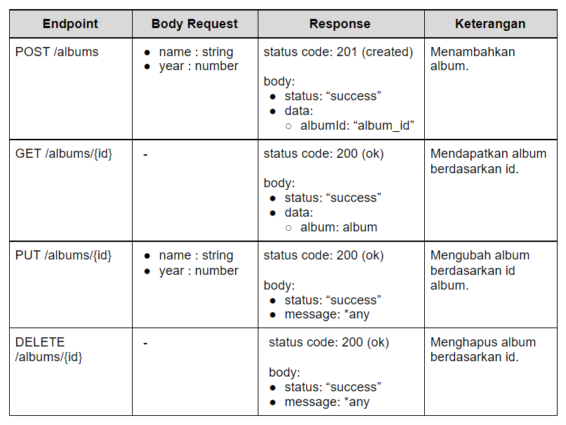
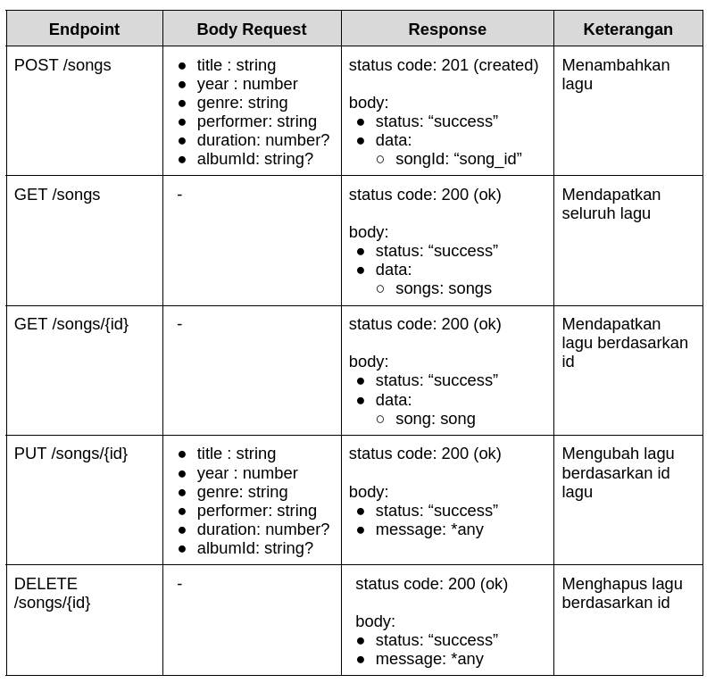

# OpenMusic API Versi 1 - Requirements Documentation

Terdapat 5 kriteria utama yang harus Anda penuhi dalam membuat proyek OpenMusic API.

## Kriteria 1: Konfigurasi Proyek Node.js

Proyek Node.js yang Anda kirimkan wajib memiliki konfigurasi sesuai yang dijelaskan di bawah ini:

- Aplikasi HTTP Server harus bisa dijalankan dengan perintah `npm run start`. Pastikan berkas `package.json` terdapat scripts start yang diatur untuk menjalankan HTTP Server.
- Memanfaatkan environment variable `HOST` dan `PORT` untuk menetapkan host dan port jalannya aplikasi HTTP Server.

## Kriteria 2: Pengelolaan Data Album

API harus menyediakan endpoint untuk pengelolaan album dengan spesifikasi berikut:



*any: merupakan nilai string apa pun selama tidak kosong.

Untuk lebih jelasnya, berikut adalah struktur response body yang harus ditampilkan pada endpoint:

### GET /albums/{id}
```json
{
  "status": "success",
  "data": {
    "album": {
      "id": "album-Mk8AnmCp210PwT6B",
      "name": "Viva la Vida",
      "year": 2008
    }
  }
}
```

## Kriteria 3: Pengelolaan Data Song

API harus menyediakan endpoint untuk pengelolaan song (lagu) dengan spesifikasi berikut:



*?: Boleh null atau undefined.
*any: merupakan nilai string apa pun selama nilainya tidak kosong.

Untuk lebih jelasnya, berikut adalah struktur response body yang harus ditampilkan pada endpoint:

### GET /songs
```json
{
    "status": "success",
    "data": {
        "songs": [
            {
                "id": "song-Qbax5Oy7L8WKf74l",
                "title": "Life in Technicolor",
                "performer": "Coldplay"
            },
            {
                "id": "song-poax5Oy7L8WKllqw",
                "title": "Centimeteries of London",
                "performer": "Coldplay"
            },
            {
                "id": "song-Qalokam7L8WKf74l",
                "title": "Lost!",
                "performer": "Coldplay"
            }
        ]
    }
}
```

### GET /songs/{id}
```json
{
    "status": "success",
    "data": {
        "song": {
            "id": "song-Qbax5Oy7L8WKf74l",
            "title": "Life in Technicolor",
            "year": 2008,
            "performer": "Coldplay",
            "genre": "Indie",
            "duration": 120,
            "albumId": "album-Mk8AnmCp210PwT6B"
        }
    }
}
```

Objek song yang disimpan harus memiliki struktur seperti contoh di bawah ini:

```json
{
  "id": "song-Qbax5Oy7L8WKf74l",
  "title": "Life in Technicolor",
  "year": 2008,
  "performer": "Coldplay",
  "genre": "Indie",
  "duration": 120,
  "albumId": "album-Mk8AnmCp210PwT6B"
}
```

## Kriteria 4: Menerapkan Data Validation

Wajib menerapkan proses Data Validation pada Request Payload sesuai spesifikasi berikut:

### POST /albums
- `name`: string, required.
- `year`: number, required.

### PUT /albums
- `name`: string, required.
- `year`: number, required.

### POST /songs
- `title`: string, required.
- `year`: number, required.
- `genre`: string, required.
- `performer`: string, required.
- `duration`: number.
- `albumId`: string.

### PUT /songs
- `title`: string, required.
- `year`: number, required.
- `genre`: string, required.
- `performer`: string, required.
- `duration`: number.
- `albumId`: string.

## Kriteria 5: Penanganan Eror (Error Handling)

### Bad Request (400)
Ketika proses validasi data pada request payload tidak sesuai (gagal), server harus mengembalikan response:
- **Status code**: 400 (Bad Request)
- **Response body**: 
  ```json
  {
    "status": "fail",
    "message": "<apa pun selama tidak kosong>"
  }
  ```

### Not Found (404)
Ketika pengguna mengakses resource yang tidak ditemukan, server harus mengembalikan response:
- **Status code**: 404 (Not Found)
- **Response body**:
  ```json
  {
    "status": "fail",
    "message": "<apa pun selama tidak kosong>"
  }
  ```

### Internal Server Error (500)
Ketika terjadi server eror, server harus mengembalikan response:
- **Status code**: 500 (Internal Server Error)
- **Response body**:
  ```json
  {
    "status": "error",
    "message": "<apa pun selama tidak kosong>"
  }
  ```

## Kriteria 6: Menggunakan Database dalam Menyimpan Data Album dan Lagu

- Data lagu harus disimpan di dalam database menggunakan PostgreSQL agar ketika di-restart data tidak akan hilang.
- Wajib menggunakan teknik migrations dengan package `node-pg-migrate` dalam mengelola struktur tabel pada database.
- Kami mengedepankan penggunaan SQL dalam mengelola database, jika Anda menggunakan ORM, submission akan ditolak.
- Wajib menyimpan nilai host, post, maupun kredensial dalam mengakses database pada environment variable dengan ketentuan:
  - `PGUSER`: menyimpan nilai user untuk mengakses database.
  - `PGPASSWORD`: menyimpan nilai password dari user database.
  - `PGDATABASE`: menyimpan nilai nama database yang digunakan.
  - `PGHOST`: menyimpan nilai host yang digunakan oleh database.
  - `PGPORT`: menyimpan nilai port yang digunakan oleh database.
- Wajib menggunakan package `dotenv` serta berkas `.env` dalam mengelola environment variable.

## Kriteria Opsional

Selain kriteria utama, terdapat kriteria opsional yang yang dapat Anda penuhi agar mendapat nilai yang baik.

### Kriteria Opsional 1: Memunculkan Daftar Lagu di Dalam Detail Album

API harus memunculkan daftar lagu di dalam album pada endpoint `GET /albums/{albumId}`. Berikut contoh response yang harus dihasilkan:

```json
{
  "status": "success",
  "data": {
    "album": {
      "id": "album-Mk8AnmCp210PwT6B",
      "name": "Viva la Vida",
      "year": 2008,
      "songs": [
        {
          "id": "song-Qbax5Oy7L8WKf74l",
          "title": "Life in Technicolor",
          "performer": "Coldplay"
        },
        {
          "id": "song-poax5Oy7L8WKllqw",
          "title": "Centimeteries of London",
          "performer": "Coldplay"
        },
        {
          "id": "song-Qalokam7L8WKf74l",
          "title": "Lost!",
          "performer": "Coldplay"
        }
      ]
    }
  }
}
```

### Kriteria Opsional 2: Query Parameter untuk Pencarian Lagu

Menerapkan query parameter pada endpoint `GET /songs` untuk fitur pencarian lagu. Berikut ketentuan parameternya:

- `?title`: mencari lagu berdasarkan judul lagu.
- `?performer`: mencari lagu berdasarkan performer.

**Catatan**: Penggunaan kedua parameter tersebut dapat dikombinasikan.